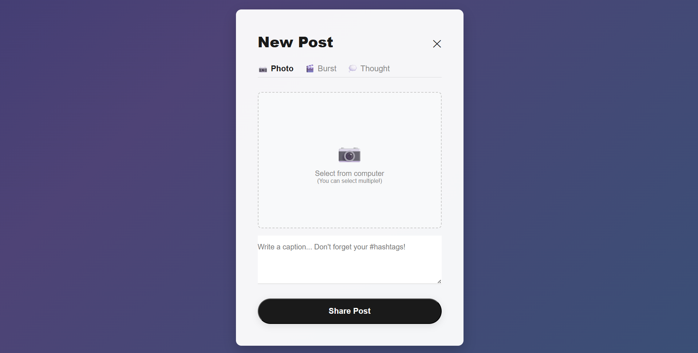
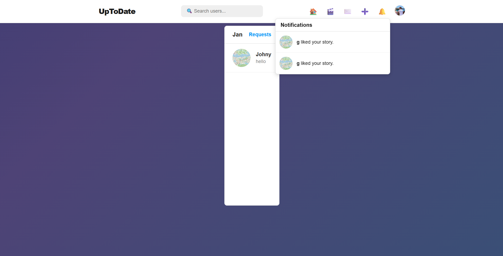
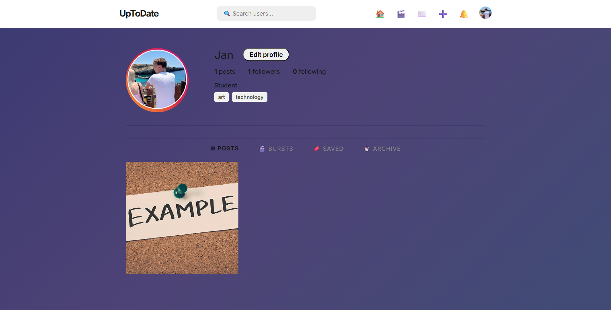
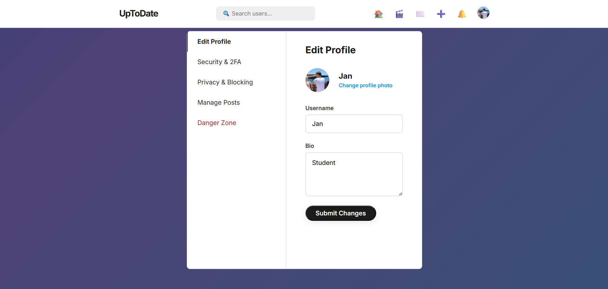
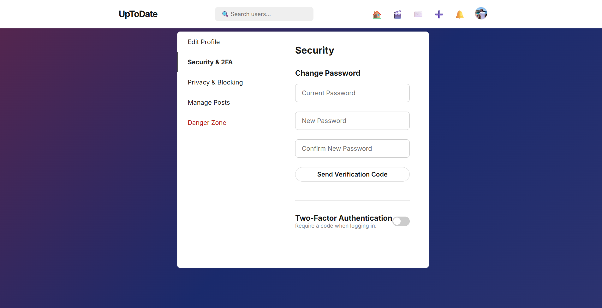

---
### 📱 Live Demos

<table style="width: 100%; text-align: center;">
  <tr>
    <td style="width: 50%;"><b>The Feed</b><br><br></td>
    <td style="width: 50%;"><b>Video Bursts (Endless Scroll)</b><br><br></td>
  </tr>
  <tr>
    <td style="width: 50%;"><b>Profile Page</b><br><br></td>
    <td style="width: 50%;"><b>Profile Settings</b><br><br></td>
  </tr>
  <tr>
    <td style="width: 50%;"><b>Privacy & Search</b><br><br></td>
    <td style="width: 50%;"><b>Messaging System</b><br><br></td>
  </tr>
</table>

### 🖼️ Interface Details

<table style="width: 100%; text-align: center;">
  <tr>
    <td style="width: 33%;"><b>Creating Posts</b><br><br></td>
    <td style="width: 33%;"><b>Notifications</b><br><br></td>
    <td style="width: 33%;"><b>Profile</b><br><br></td>
  </tr>
  <tr>
    <td style="width: 33%;"><b>Settings</b><br><br></td>
    <td style="width: 33%;"><b>More Settings</b><br><br></td>
    <td style="width: 33%;"></td> </tr>
</table>

# UpToDate - Full-Stack Social Media Platform


**UpToDate** is a highly scalable, feature-rich social media platform inspired by Instagram. Built from the ground up to handle complex data relationships, it features an algorithmic feed, 24-hour expiring stories, endless-scrolling video "Bursts," real-time telemetry, and secure direct messaging.

This project was developed to demonstrate proficiency in backend system design, relational database optimization, asynchronous telemetry, and dynamic frontend rendering without relying on heavy SPA frameworks.

## 🚀 Key Features & Technical Highlights

### 🧠 Algorithmic Content Feed
Instead of a simple chronological feed, UpToDate utilizes a custom, multi-factor scoring algorithm to deliver personalized content. The feed is generated dynamically using a SQL/Java hybrid approach based on:
* **Social Graph Priority:** Heavy score multipliers for posts by followed users.
* **Creator Affinity:** Calculates historical engagement (likes/comments) to map relationships between the viewer and specific creators.
* **Content Interest Matching:** Cross-references the user's top 5 weighted interests with post hashtags.
* **Recency & Dwell Time:** Boosts fresh content and tracks video completion rates via `IntersectionObserver` telemetry.

### ⏱️ Ephemeral Stories & Telemetry Engine
* **24-Hour Lifecycle:** Stories automatically expire exactly 24 hours after posting via SQL time-based filtering (no cron jobs required).
* **Auto-Archiving:** Expired stories seamlessly migrate to a private, owner-only archive.
* **Active Ring UI:** Followed users with unseen stories are dynamically pulled to the top of the feed using optimized `LEFT JOIN FETCH` queries to prevent N+1 queries.
* **Viewer Analytics:** Owners can track exactly who viewed and liked their stories through a custom full-screen playback engine.

### 🎬 "Bursts" (Short-Form Video)
* An endless, scroll-snapping video feed similar to Reels/TikTok.
* Videos auto-play and pause based on viewport visibility (`IntersectionObserver`).
* Client-to-server telemetry pings the backend when a user watches 95% of a Burst, automatically tuning their algorithmic interest weights.

### 💬 Secure Direct Messaging
* **Rich Media Support:** Send text, images, videos, and GIFs.
* **Voice Notes:** Integrated browser `MediaRecorder` API allowing users to record and send `.webm` / `.m4a` voice messages directly in the chat.
* **Server-Side Validation:** All media uploads are validated via magic bytes (file signatures) to prevent malicious payload smuggling, bypassing unreliable client-side MIME types.
* **Proxy GIF API:** Integrated with KLIPY API, utilizing backend proxy endpoints to prevent exposing API keys to the client.

### 🔒 Enterprise-Grade Security
* **Spring Security:** Fully integrated session management, CSRF protection, and BCrypt password hashing.
* **Two-Factor Authentication (2FA):** Time-based One-Time Passwords (TOTP) utilizing Google Authenticator/Authy, complete with a secure 2FA "Waiting Room" routing layer.
* **Privacy Controls:** Granular settings for Public/Private accounts, blocking users, and managing pending follow requests.

---

## 🛠️ Tech Stack

* **Backend:** Java, Spring Boot, Spring Security, Spring Data JPA, Hibernate ORM
* **Database:** Oracle DB (21c XE), HikariCP Connection Pooling
* **Frontend:** HTML5, CSS3, Vanilla JavaScript, Thymeleaf (Server-Side Templating)
* **File Storage:** Local File System (extensible to AWS S3)
* **External APIs:** KLIPY (GIFs), ZXing (QR Code Generation), JavaMailSender (SMTP)

---

## ⚙️ Local Setup & Installation

### Prerequisites
* Java Development Kit (JDK) 21 or higher
* Oracle Database (or update `application.properties` dialect for PostgreSQL/MySQL)
* Maven

### Installation Steps

1.  **Clone the repository**
    ```bash
    git clone [https://github.com/yourusername/uptodate.git](https://github.com/yourusername/uptodate.git)
    cd uptodate
    ```

2.  **Configure the Database & Environment**
    Open `src/main/resources/application.properties` and update the following variables to match your environment:
    ```properties
    # Database Configuration
    spring.datasource.url=jdbc:oracle:thin:@//localhost:1521/XE
    spring.datasource.username=YOUR_DB_USER
    spring.datasource.password=YOUR_DB_PASSWORD
    
    # SMTP Email Configuration (For Registration & Verification)
    spring.mail.username=your-email@gmail.com
    spring.mail.password=your-app-password
    
    # GIF Provider API
    gif.klipy.api-key=YOUR_KLIPY_API_KEY
    ```
    
    

3.  **Build and Run the Application**
    ```bash
    mvn clean install
    mvn spring-boot:run
    ```

4.  **Access the Platform**
    Open your browser and navigate to `http://localhost:8080`.

---

## 🗄️ Database Architecture Highlights
The application relies on highly normalized relational tables mapped via Hibernate. Notable design decisions include:
* **Self-Referencing Many-to-Many:** Used for the Follower/Following system and nested comment replies.
* **Intersection Tables:** Extensive use of join tables for mapping `post_likes`, `user_saved_posts`, and `story_viewers` to ensure scalable reads.
* **Join Fetching:** Strategic use of `@Query("SELECT u FROM User u LEFT JOIN FETCH...")` to mitigate Hibernate N+1 query performance bottlenecks on the feed.

---

## 📞 Contact
**Jan Gradkowski** * [LinkedIn](https://www.linkedin.com/in/jan-gradkowski-aa6491397/) 
* [Email](mailto:jan.gradkowski01@gmail.com)

*Currently seeking opportunities in Software Engineering and Backend Development.*
